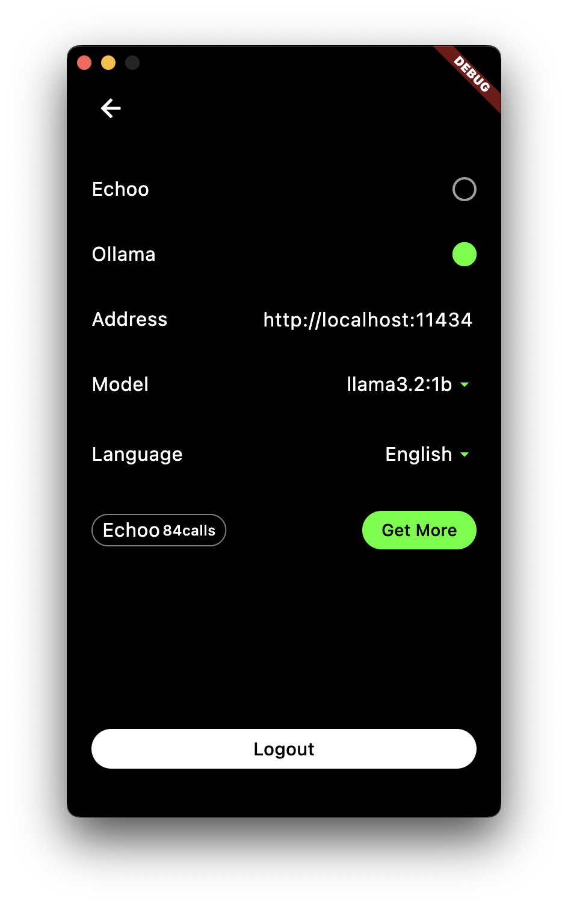

# Echoo Android

> A secure, privacy-focused Ollama client for Android. All data stays local - no accounts, no tracking, just pure AI interaction with your Ollama models. Ideal for anyone who wants to use AI while keeping their data private.

## App Preview

|  |  |
|:---:|:---:|
| Home Screen | Settings Screen |

## Key Features

- 🔒 Privacy-Focused
  - No user identification required
  - No data analytics or tracking
  - Locally encrypted chat history
  
- 🤖 Complete Ollama Integration
  - Support for all Ollama models
  - Smart context management
  - Automatic long conversation summarization

- ⚡ Efficient Features
  - No registration needed
  - Clean user interface
  - Fast local deployment

## Quick Start

1. Clone and open in Android Studio:
```bash
git clone https://github.com/echoo-app/echoo.git
```

2. Build debug version:
```bash
./gradlew assembleDebug
```

APK will be in `app/build/outputs/apk/debug/`

## License

MIT License
